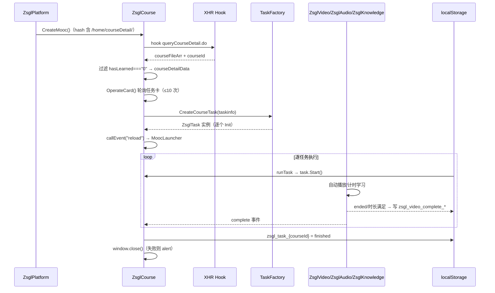
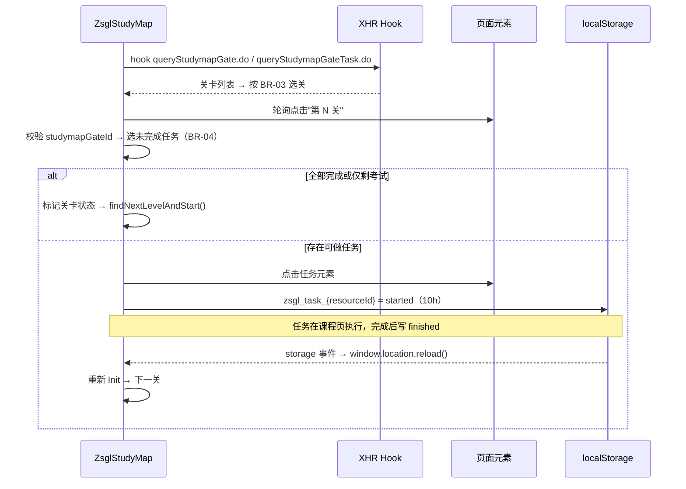
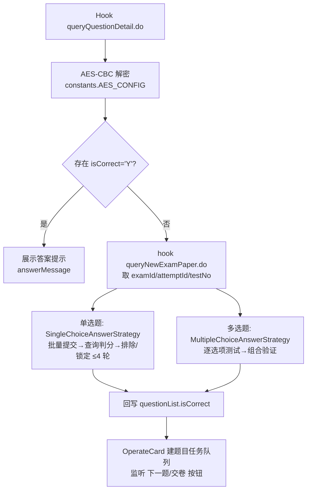
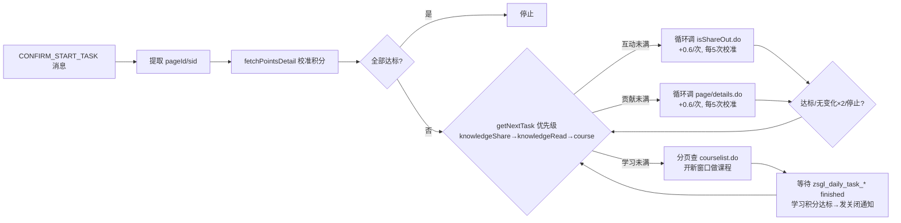

# 概要设计说明书

**项目名称**：course-tools zsgl 模块
**作者**：李荣起
**日期**：2026-09-15
**版本**：1.26.915.699
**生成范围**：全部 7 套
**文档语言**：中文

## 变更日志

| 版本 | 日期 | 作者 | 变更内容 |
|------|------|------|----------|
| 1.26.915.699 | 2026-09-15 | 李荣起 | 初始版本 |

---

## 一、系统架构

### 1.1 总体架构

zsgl 模块运行在 course-tools 扩展的内容脚本环境（page context）中，采用"宿主内核 + 平台适配层"的分层结构：

```
┌─────────────────────────────────────────────────────────────┐
│  zsgl.lzlj.com 页面（React/MUI SPA）                          │
├─────────────────────────────────────────────────────────────┤
│  平台适配层（src/mooc/zsgl/）                                 │
│  ┌────────────┐  ┌──────────────────────────────────────┐   │
│  │ ZsglPlatform│  │ 业务实现                              │   │
│  │ (页面路由)   │→ │ course / studyMap / exam / video /   │   │
│  └────────────┘  │ scorm / knowledge / dailyPoints      │   │
│                  └──────────────────────────────────────┘   │
│  ┌────────────────────────────┐  ┌───────────────────────┐  │
│  │ 基础设施 utils              │  │ 数据通道               │  │
│  │ XHR Hook / TimerManager /  │  │ localStorage 信号      │  │
│  │ DOM 查找 / 事件阻止         │  │ window.postMessage     │  │
│  │ 考试 API 签名(exam-utils)  │  │ ChromeServerMessage    │  │
│  └────────────────────────────┘  └───────────────────────┘  │
├─────────────────────────────────────────────────────────────┤
│  宿主内核（src/internal/）                                    │
│  Application / MoocLauncher / DefaultMoocFactory /           │
│  Task / EventListener / ChromeConfigItems / Logger           │
├─────────────────────────────────────────────────────────────┤
│  平台后端（zsgl.lzlj.com/learn/app/clientapi/*.do）           │
└─────────────────────────────────────────────────────────────┘
```

要点：

- 入口链路：`src/mooc.ts` 创建 `Application` → `MoocLauncher.start()` → `DefaultMoocFactory.CreateMooc()` → `ZsglPlatform.CreateMooc()`（[mooc.ts](../../../src/internal/app/mooc.ts) 中其余平台已注释，zsgl 为唯一启用平台）。
- 页面路由依据 `window.location.hash`（[constants.ts](../../../src/mooc/zsgl/constants.ts) 的 `URL_PATTERNS`）。
- 对平台服务器的交互有两种方式：**被动拦截**（XHR Hook 读响应）与**主动请求**（fetch 携带签名 headerMap）。

### 1.2 模块划分

| 模块（文件） | 职责 | 关键类/函数 |
|--------------|------|-------------|
| platform.ts | hash 路由识别页面，返回对应 Mooc 实例 | `ZsglPlatform` |
| factory.ts | 按 cwType 创建课程任务；创建考试题目任务 | `TaskFactory` |
| course.ts | 课程详情页任务集：拦截数据、建队列、调度、完成上报、关页监听 | `ZsglCourse`、`ZsglCourseControlBar` |
| task.ts | zsgl 任务抽象基类与控制栏 UI | `ZsglTask`、`ZsglTaskControlBar` |
| video.ts | 课程页视频任务：自动播放/倍速/恢复/保活/完成通知 | `ZsglVideo` |
| scorm.ts | SCORM 课件任务：跨 iframe 深度查找视频并播放 | `ZsglAudio` |
| knowledge.ts | 知识点任务：进入学习页计时等待后退出 | `ZsglKnowledge` |
| studyMap.ts | 学习地图：关卡选择、任务跳转、跨页握手 | `ZsglStudyMap` |
| exam.ts | 考试：解密答案提示、自动破解编排、题目任务 | `ZsglExam`、`ZsglQuestionTask` |
| exam-answer-strategy.ts | 单选题批量排除法策略 | `SingleChoiceAnswerStrategy` |
| utils/exam-answer-strategy.ts | 多选题两阶段破解策略 | `MultipleChoiceAnswerStrategy` |
| utils/exam-utils.ts | 考试 API 请求封装与签名（headerMap） | `sendExamApiRequest`、`generateHeaderMap` |
| dailyPoints.ts | 每日积分模式：三类积分任务调度与状态管理 | `ZsglDailyPoints` |
| constants.ts | 常量：选择器、URL、AES 配置、存储前缀、文案 | `ZSGL_CONSTANTS` |
| types.ts | 领域类型定义 | `TaskInfo`、`QuestionInfo` 等 |
| utils/utils.ts | 通用工具：XHR Hook、TimerManager、DOM 查找、事件阻止 | `hookHttpRequest` 等 |

### 1.3 类图关系

```mermaid
classDiagram
    class MoocFactory { <<interface>> CreateMooc() }
    class DefaultMoocFactory
    class ZsglPlatform { +CreateMooc() Mooc }
    class MoocTaskSet { <<interface>> Init() Stop() Next() SetTaskPointer() }
    class Task { <<abstract>> Init() Start() Submit() Stop() Done() Type() }
    class ZsglTask { <<abstract>> #taskinfo #context #done }
    class ZsglCourse { -courseDetailData -taskList -taskIndex }
    class ZsglStudyMap { -studyMapData -gateTaskData }
    class ZsglExam { -questionList -examId -attemptId -testNo }
    class ZsglDailyPoints { -pointsState -sid -pageId }
    class ZsglVideo
    class ZsglAudio
    class ZsglKnowledge
    class ZsglQuestionTask
    class TaskFactory { {static} +CreateCourseTask() {static} +CreateQuestionTask() }
    class SingleChoiceAnswerStrategy { +crackSingleChoiceBatch() }
    class MultipleChoiceAnswerStrategy { +crackMultipleChoiceBatch() }

    DefaultMoocFactory ..|> MoocFactory
    ZsglPlatform ..|> MoocFactory
    DefaultMoocFactory --> ZsglPlatform : 创建
    ZsglPlatform --> ZsglCourse : courseDetail 页
    ZsglPlatform --> ZsglStudyMap : studyDetail 页
    ZsglPlatform --> ZsglExam : examDetail 页
    ZsglCourse ..|> MoocTaskSet
    ZsglExam ..|> MoocTaskSet
    ZsglTask --|> Task
    ZsglVideo --|> ZsglTask
    ZsglAudio --|> ZsglTask
    ZsglKnowledge --|> ZsglTask
    ZsglQuestionTask --|> ZsglTask
    ZsglStudyMap --|> Task
    ZsglDailyPoints --|> Task
    ZsglCourse --> TaskFactory : 建任务
    TaskFactory --> ZsglVideo
    TaskFactory --> ZsglAudio
    TaskFactory --> ZsglKnowledge
    TaskFactory --> ZsglQuestionTask
    ZsglExam --> TaskFactory : 建题目任务
    ZsglExam --> SingleChoiceAnswerStrategy
    ZsglExam --> MultipleChoiceAnswerStrategy
```

> 注：`EventListener` 为内核提供的观察者基类，`ZsglCourse`/`ZsglExam` 继承它以发布 `MoocEvent`（reload/examReload/taskComplete/questionTaskComplete/examTaskComplete 等），由 `MoocLauncher.runMoocTask`（[mooc/mooc.ts](../../../src/mooc/mooc.ts)）统一订阅驱动。

## 二、核心流程概要

### 2.1 课程学习流程



### 2.2 学习地图流程



### 2.3 考试流程



### 2.4 每日积分流程



## 三、依赖关系

### 3.1 对宿主内核的依赖

| 依赖 | 用途 |
|------|------|
| `Application.App.config` | 配置读写（`zsgl_` 命名空间：auto/skip_elective/video_mute/video_multiple/interval/daily_points_* 等） |
| `Application.App.log` | 分级日志 |
| `Task`（internal/app/task） | 任务基类：事件、生命周期（Init/Start/Submit/Stop/Done/Type） |
| `Mooc/MoocTaskSet/MoocFactory`（internal/app/mooc） | 平台接入契约 |
| `EventListener`（internal/utils/event） | 事件发布/订阅 |
| `NewChromeServerMessage`（internal/utils/message） | 扩展前后台消息（"zsgl-tools" 通道） |
| `createBtn/protocolPrompt/get`（internal/utils/utils） | UI 按钮创建、协议确认弹窗、HTTP GET |
| `CssBtn`（mooc/chaoxing/utils） | 按钮样式（复用超星模块样式函数） |

### 3.2 外部依赖

| 依赖 | 用途 |
|------|------|
| crypto-js | AES-CBC/PKCS7 解密考试题目详情响应 |
| md5 | 生成考试接口签名（nonce 与 sign） |

### 3.3 对平台系统的依赖

| 接口 | 方式 | 说明 |
|------|------|------|
| `queryCourseDetail.do` | XHR 拦截 | 课程任务清单 |
| `queryStudymapGate.do` / `queryStudymapGateTask.do` | XHR 拦截 | 关卡与关卡任务 |
| `queryQuestionDetail.do` | XHR 拦截 + AES 解密 | 考试题目与答案 |
| `queryNewExamPaper.do` | XHR 拦截 + AES 解密 | 考试参数（examId/attemptId/testNo/questionIdList） |
| `courselist.do`、`knowledgecloud/page/details.do`、`cloud/page/like/isShareOut.do`、`personal/statistics/queryUserPointPercent.do` | fetch 主动请求 | 每日积分 |
| `exam/new/submitQuestionAnswer.do`、`exam/new/queryQuestionAnswer.do` | fetch 主动请求 + headerMap 签名 | 答案破解 |

## 四、设计决策

| 决策 | 说明 |
|------|------|
| 被动拦截优先 | 课程/地图/考试数据均通过 XHR Hook 读取平台自身请求响应，避免主动请求引入额外签名/风控面 |
| localStorage 作跨页总线 | 课程页与地图页/每日积分调度器分属不同页面，利用同源 localStorage + storage 事件 + 轮询兜底实现 started/finished/close 信号 |
| TimerManager 统一定时器 | 所有 setTimeout/setInterval 收口管理，Stop 时 clearAll，避免页面切换后定时器残留 |
| 事件阻止 + 媒体保活 | 捕获阶段拦截 blur/visibilitychange 等事件，并播放 0 音量循环音频维持"媒体播放中"状态对抗最小化暂停 |
| 策略类独立 | 单选/多选破解算法独立成策略类（可测试、可替换），与考试编排（ZsglExam）解耦 |
| 常量集中 | 选择器、URL、文案、密钥全部集中在 constants.ts，平台前端改版时仅需调整一处 |
